Let's explore the world of Reinforcement Learning through implementation using python as simplified as possible. 

I'm assuming you have basic foundational knowledge of Markov Decision Processes (MDPs) and Dynamic Programming (DP). Most RL algorithms can be viewed as attempts to achieve much the same effect as DP, only with less computation. 

You'll see the implementation of the classical reinforcement learning algorithms from [Reinforcement Learning: An Introduction](https://inst.eecs.berkeley.edu/~cs188/sp20/assets/files/SuttonBartoIPRLBook2ndEd.pdf) on various environments
 - Dynamic Programming (Policy and Value Iteration)
 - Monte Carlo Methods (Prediction and Control)
 - Temporal Difference (SARSA and Q-Learning) 
 - Value Function Approximation (DQN, DDQN)
 - Policy gradient methods (REINFORCE)
 - Actor Critic methods (DDPG, PPO, TRPO, A2C, TD3, SAC, RPO, AMP)
 - Model Based methods (Dyna-Q, PETS)

## Project layout
- `core/algorithms/monte_carlo`: Blackjack Monte Carlo prediction and control.
- `core/algorithms/tabular`: Dynamic programming and temporal-difference methods for grid worlds.
- `core/env`: The grid world environment and configs.
- `core/utils`: Small numeric helpers.
- `examples`: Runnable scripts demonstrating the algorithms.
- `tests`: Placeholder suite ready for real unit tests.
- `results`: Saved figures produced by the examples.

## Setup
- Install dependencies: `pip install -r requirements.txt`
- (Optional) Editable install with dev tools: `pip install -e .[dev]`
- Lint/format/test: `ruff format --check . && ruff check . && pytest`

## Dynamic Programming
Dynamic programming (DP) is a powerful approach to solving reinforcement learning problems by breaking them down into smaller subproblems and solving them iteratively. One of the key concepts in DP is the notion of policy iteration.

Policy iteration is a general framework for finding an optimal policy in reinforcement learning. It consists of two main steps: policy evaluation and policy improvement.

Policy Evaluation: In this step, the value function of a given policy is iteratively updated until it converges to the true value function. This is typically done using the Bellman equation, which expresses the value of a state as the expected sum of rewards that can be obtained from that state following the current policy.

Policy Improvement: Once the value function has been evaluated, the policy is improved based on the current value function. This is done by selecting actions that lead to states with higher values according to the current value function. The new policy may be deterministic (greedy) or stochastic, depending on the problem and the specific algorithm being used.

These two steps are repeated iteratively until the policy converges to the optimal policy, which maximizes the expected cumulative reward over time.

- ### Policy Iteration: 

    The following code snippets perform policy iteration on a grid world from `examples/policy_iteration_gridworld.py`.

    First, it defines the dimensions of the grid world, the start state, the goal state, and the locations of obstacles. Then, it creates an instance of the GridWorld class with these parameters.
 
        ncols = 4
        start_state = (0, 0)
        goal_state = (3, 3)
        obstacles = [(1, 1),(0, 2)]

        grid_world = GridWorld(nrows, ncols, start_state, goal_state)
   

    Next, it adds obstacles, rewards, and dynamics to the grid world.

        grid_world.add_obstacles(obstacles)
        grid_world.add_rewards(-1.0, 100.0)
        grid_world.dynamics() 

    After that, it generates a random policy for the grid world.
        
        policy = grid_world.random_policy()

    Then, it uses the PolicyIteration function to iteratively update the value function and policy until convergence. The value function V and the optimal policy policy are returned.

        V, policy = PolicyIteration(grid_world, theta=0.0001)

    Finally, it creates an instance of the GridWorldVisualization class and plots the grid world with arrows indicating the optimal policy.

        visualization = GridWorldVisualization(grid_world)
        visualization.plot_grid_with_arrows(grid_world, policy)

    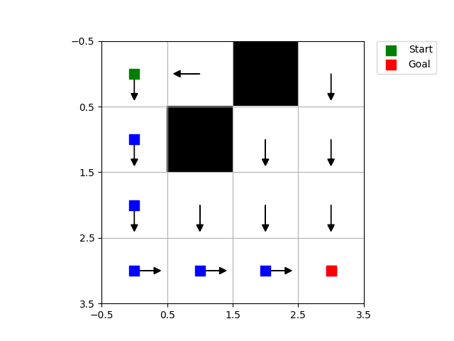

One drawback to policy iteration is that each of its iterations involves policy evaluation, which may itself be a protracted iterative computation requiring multiple sweeps through the state set.  Must we wait for exact convergence, or can we stop short of that? 

In fact, the policy evaluation step of policy iteration can be truncated in several ways without losing the convergence guarantees of policy iteration. One important special case is when policy evaluation is stopped after just one sweep (one update of each state). This algorithm is called value iteration.

- ### Value Iteration
    The file `examples/value_iteration_gridworld.py` has the exact similar structure as above which results in the same policy but since it performs only on step of policy evaluation instead of converging, it is much faster than `examples/policy_iteration_gridworld.py`. In order to check the performance of both try running the hard grid problem for both and time it. Following is the result for the hard grid problem using value iteration.

    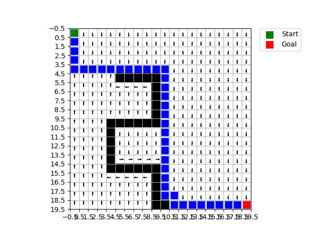

## Monte Carlo methods on BlackJack

This folder contains implementations and experiments of Monte-Carlo (MC) prediction and control algorithms, evaluated on the **Blackjack-v1** environment (Gymnasium, `sab=True` semantics).

---

### Algorithms & Math

### 1. Monte Carlo Prediction
- Goal: estimate  

  $v_\pi(s) = \mathbb{E}_\pi[G_t \mid S_t = s]$

- Return:

  $G_t = R_{t+1} + \gamma R_{t+2} + \dots + \gamma^{T-t-1} R_T$

- **First-Visit MC**: update only on the first visit of \(s\) in each episode.  
- **Every-Visit MC**: update on *every* occurrence of \(s\).  

- Value estimate:

  $V(s) \leftarrow \frac{1}{N(s)} \sum_{i=1}^{N(s)} G_i$

---

### 2. Exploring Starts (MC Control)
- Control = learn \( q_*(s,a) \) by trying all actions in all states.  
- **Exploring Starts**: each episode starts with a random state–action pair, ensuring coverage.  

- Update rule:

  $Q(s,a) \leftarrow \frac{1}{N(s,a)} \sum_{i=1}^{N(s,a)} G_i$

- Policy improvement: greedy w.r.t. \(Q\).

---

### 3. On-Policy First-Visit MC Control (ε-greedy)
- Behavior = ε-greedy w.r.t. current Q.  
- GLIE: with enough episodes and decaying ε, guarantees convergence to optimal policy.  
- Same update as above, but with episodes generated by ε-greedy.

---

### 4. Off-Policy Every-Visit MC Control (Importance Sampling)
- Target = greedy policy.  
- Behavior = ε-greedy.  

- Importance ratio for an episode:

  $\rho = \prod_{t} \frac{\pi(A_t \mid S_t)}{b(A_t \mid S_t)}$

- **Ordinary IS**:

  $Q(s,a) \approx \frac{1}{N(s,a)} \sum \rho \, G$

- **Weighted IS**:

 $ Q(s,a) \approx \frac{\sum \rho \, G}{\sum \rho}$

- Weighted IS has lower variance.

---

### Results

### Value Functions
- **Every-Visit MC Prediction** produced state-value heatmaps.  
- With a **usable ace**, states around 19–21 have high positive value.  
- With **no usable ace**, values are lower due to increased bust probability.

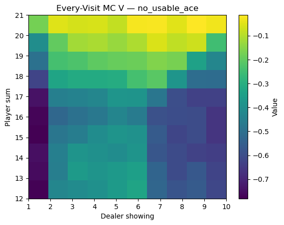  
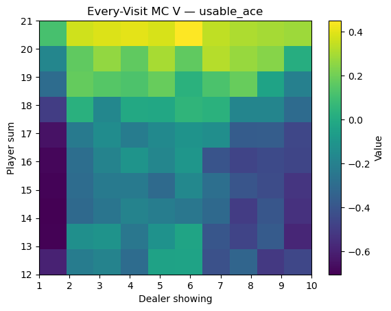

---

### Policies
- **Exploring Starts Control** produces a clean greedy policy boundary: stick on 19+, hit below.  
  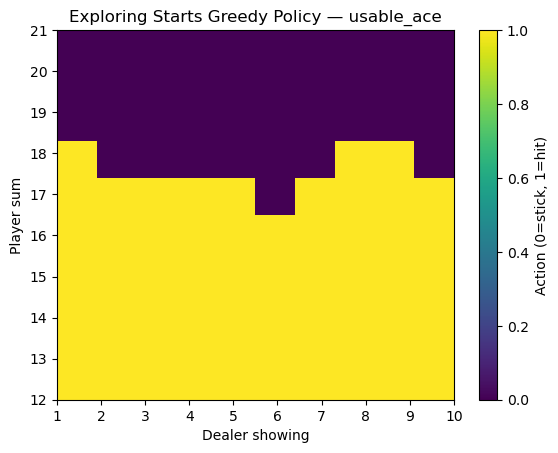

- **On-Policy FV MC Control (ε-greedy)** learns a similar boundary, but with some noise due to exploration.  
  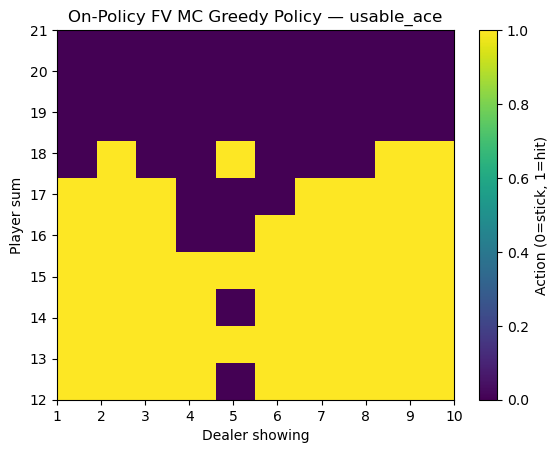  
  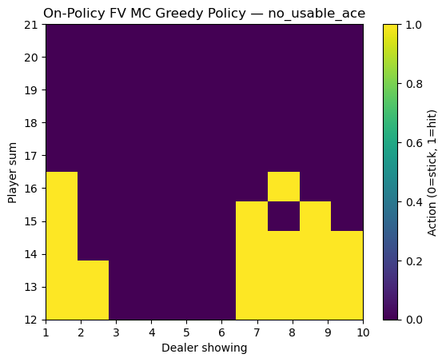

- **Off-Policy EV MC Control (Weighted IS)** is more unstable in Blackjack (because episodes often deviate from the greedy target). The learned policy is patchy and converges slowly.  
  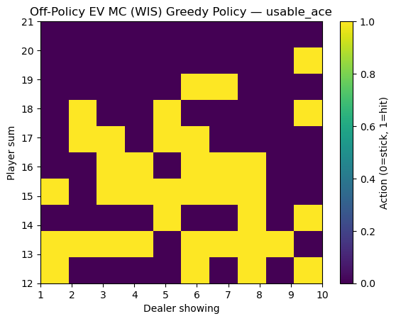  
  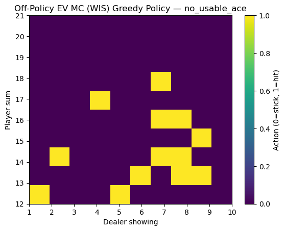

---

### Learning Curves
We also compare the **average return vs. training episodes** across algorithms.  
Returns are evaluated under the current greedy policy every few thousand episodes.

- **Exploring Starts** converges fast and steadily.  
- **On-Policy FV MC** improves gradually but is noisier due to ε-greedy exploration.  
- **Off-Policy EV MC (Weighted IS)** shows unstable learning with high variance.

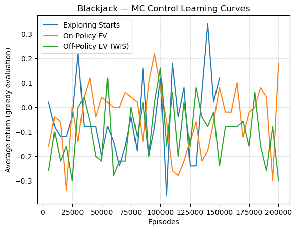

---

### Takeaways
- **MC Prediction** gives interpretable state-value heatmaps.  
- **Exploring Starts** control converges quickly to near-optimal strategy.  
- **On-Policy ε-greedy** works but is slower and noisier.  
- **Off-Policy IS** is theoretically correct, but in Blackjack the variance is large, and practical convergence is poor without many more episodes.  

## Temporal Difference

Temporal Difference (TD) learning is a type of reinforcement learning algorithm that combines aspects of both dynamic programming and Monte Carlo methods.

DP methods involve solving problems by breaking them down into smaller subproblems, typically using a bottom-up approach. In the context of reinforcement learning, DP algorithms (like the Bellman equation) are used to calculate the value function by iteratively updating estimates based on the expected future rewards.

Monte Carlo (MC) methods, on the other hand, involve learning from experience by averaging sampled returns obtained from complete episodes. MC methods do not require a model of the environment and are often used in situations where the environment is stochastic or episodic.

Temporal Difference learning bridges the gap between DP and MC methods by updating value estimates based on a combination of bootstrapping (using current estimates to update future estimates) and sampling (using actual experiences). Instead of waiting until the end of an episode to update value estimates, TD methods update them after each time step based on the observed reward and the estimate of the value of the next state.

Here, I'm showing you the results on the classic cliff world example using SARSA (on-policy control TD(0)) and Q-learning (off-policy control TD(0)). Feel free to run the scripts named ``examples/sarsa_cliffworld.py`` and ``examples/qLearning_cliffworld.py``.

- SARSA Rewards: 
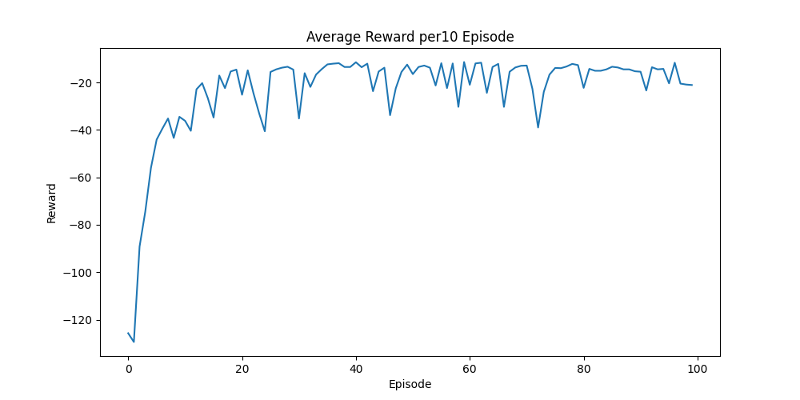 

- SARSA policy and optimal trajectory: 
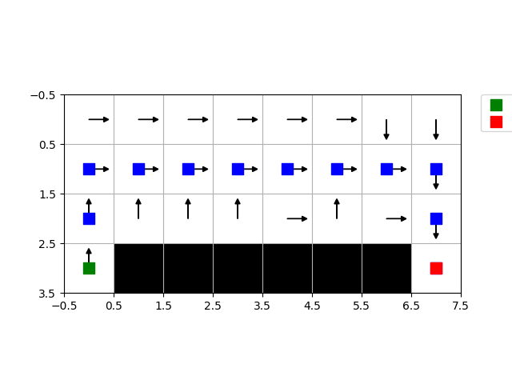 

- Q-learning Rewards: 
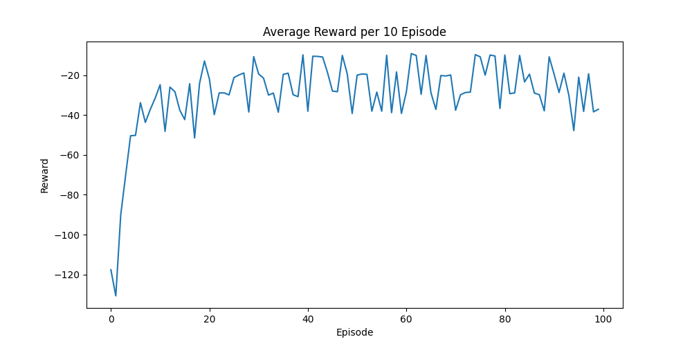 

- Q-learning policy and optimal trajectory:
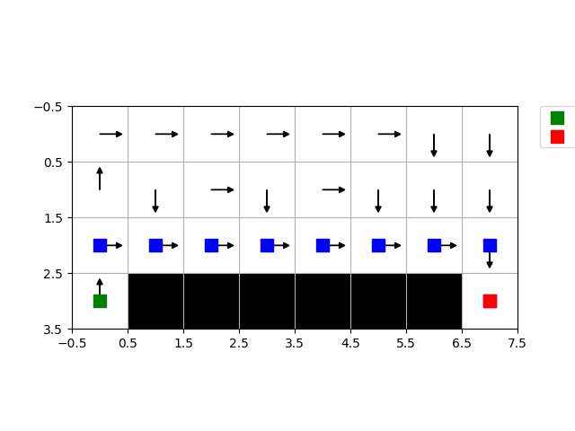 

Q-learning learns values for the optimal policy, that which travels right along the edge of the cliff. Unfortunately, this re sults in its occasionally falling off
the cliff because of the $\epsilon$-greedy action selection. Sarsa, on the other hand, takes the action selection into account and learns the longer but safer path through the upper part per epsiode of the grid.
## Value Function Approximation (tbd)

## Policy Gradient methods (tbd)

## Actor-Critic methods (tbd)
