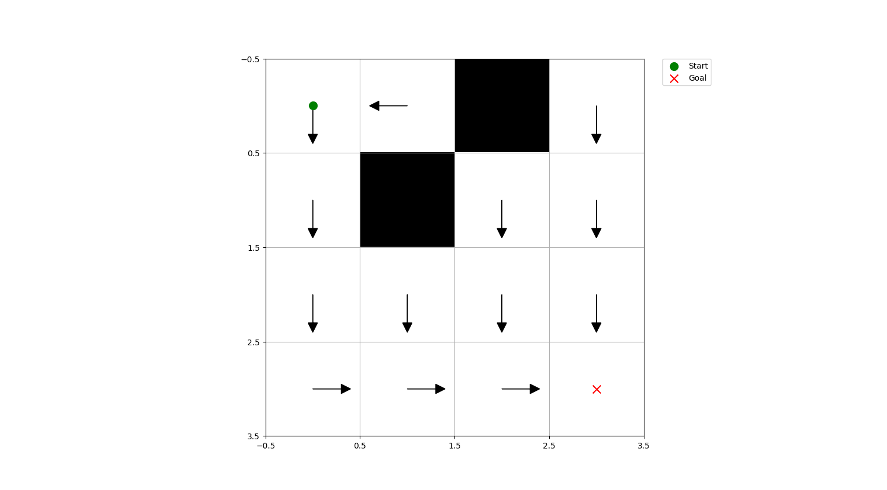

Let's explore the world of Reinforcement Learning through implementation using python. 

I'm assuming you have basic foundational knowledge of Markov Decision Processes (MDPs) and Dynamic Programming (DP). Most RL algorithms can be viewed as attempts to achieve much the same effect as DP, only with less computation. 

You'll see the implementation of the classical reinforcement learning algorithms from [Reinforcement Learning: An Introduction](https://inst.eecs.berkeley.edu/~cs188/sp20/assets/files/SuttonBartoIPRLBook2ndEd.pdf) on various environments
 - Dynamic Programming (Policy and Value Iteration)
 - Temporal Difference (SARSA and Q-Learning) 
 - Value Function Approximation (DQN)
 - Policy gradient method (REINFORCE)
 - Actor Critic methods (DDPG, PPO, TRPO, A3C, TD3, SAC)

## Dynamic Programming
- ### Policy Iteration: 

    The following code snippets perform policy iteration on a grid world from `policy_iteration_gridworld.py`.

    First, it defines the dimensions of the grid world, the start state, the goal state, and the locations of obstacles. Then, it creates an instance of the GridWorld class with these parameters.
 
        ncols = 4
        start_state = (0, 0)
        goal_state = (3, 3)
        obstacles = [(1, 1),(0, 2)]

        grid_world = GridWorld(nrows, ncols, start_state, goal_state)
   

    Next, it adds obstacles, rewards, and dynamics to the grid world.

        grid_world.add_obstacles(obstacles)
        grid_world.add_rewards(-1.0, 100.0)
        grid_world.dynamics() 

    After that, it generates a random policy for the grid world.
        
        policy = grid_world.random_policy()

    Then, it uses the PolicyIteration function to iteratively update the value function and policy until convergence. The value function V and the optimal policy policy are returned.

        V, policy = PolicyIteration(grid_world, theta=0.0001)

    Finally, it creates an instance of the GridWorldVisualization class and plots the grid world with arrows indicating the optimal policy.

        visualization = GridWorldVisualization(grid_world)
        visualization.plot_grid_with_arrows(grid_world, policy)

    

- ### Value Iteration
    The file `value_iteration_gridworld.py` has the exact similar structure as above which results in the same policy but since it performs only on step of policy evaluation instead of converging, it is much faster than `policy_iteration_gridworld.py`.
