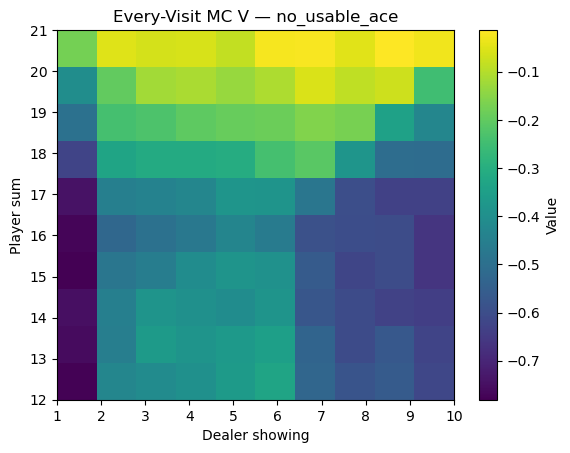
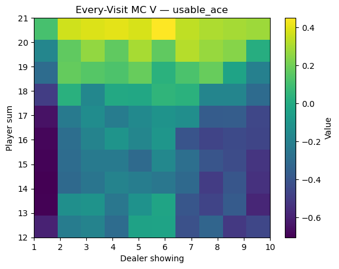
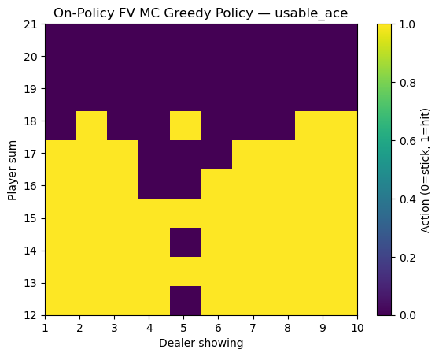
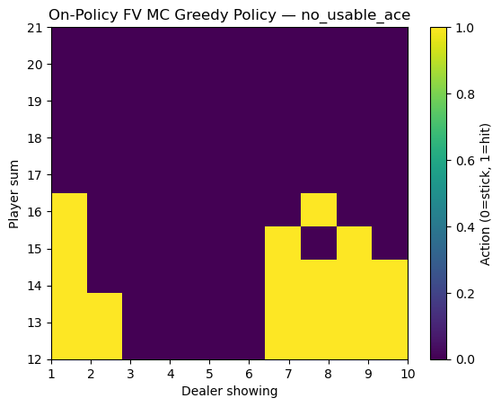
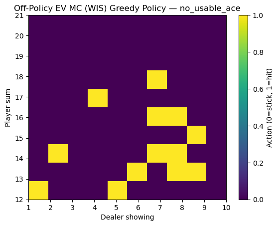
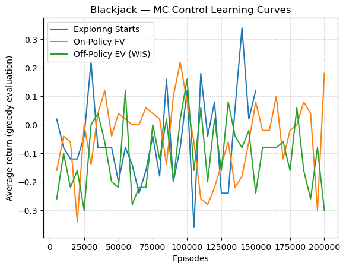

## Monte Carlo methods on BlackJack

This folder contains implementations and experiments of Monte-Carlo (MC) prediction and control algorithms, evaluated on the **Blackjack-v1** environment (Gymnasium, `sab=True` semantics).

---

### Utilities
- Plotting helpers for Blackjack value/policy heatmaps now live in `core/utils/plotting.py` so they can be reused by Monte-Carlo and temporal-difference methods.

---

### Algorithms & Math

### 1. Monte Carlo Prediction
- Goal: estimate  

  $v_\pi(s) = \mathbb{E}_\pi[G_t \mid S_t = s]$

- Return:

  $G_t = R_{t+1} + \gamma R_{t+2} + \dots + \gamma^{T-t-1} R_T$

- **First-Visit MC**: update only on the first visit of \(s\) in each episode.  
- **Every-Visit MC**: update on *every* occurrence of \(s\).  

- Value estimate:

  $V(s) \leftarrow \frac{1}{N(s)} \sum_{i=1}^{N(s)} G_i$

---

### 2. Exploring Starts (MC Control)
- Control = learn \( q_*(s,a) \) by trying all actions in all states.  
- **Exploring Starts**: each episode starts with a random state–action pair, ensuring coverage.  

- Update rule:

  $Q(s,a) \leftarrow \frac{1}{N(s,a)} \sum_{i=1}^{N(s,a)} G_i$

- Policy improvement: greedy w.r.t. \(Q\).

---

### 3. On-Policy First-Visit MC Control (ε-greedy)
- Behavior = ε-greedy w.r.t. current Q.  
- GLIE: with enough episodes and decaying ε, guarantees convergence to optimal policy.  
- Same update as above, but with episodes generated by ε-greedy.

---

### 4. Off-Policy Every-Visit MC Control (Importance Sampling)
- Target = greedy policy.  
- Behavior = ε-greedy.  

- Importance ratio for an episode:

  $\rho = \prod_{t} \frac{\pi(A_t \mid S_t)}{b(A_t \mid S_t)}$

- **Ordinary IS**:

  $Q(s,a) \approx \frac{1}{N(s,a)} \sum \rho \, G$

- **Weighted IS**:

 $ Q(s,a) \approx \frac{\sum \rho \, G}{\sum \rho}$

- Weighted IS has lower variance.

---

### Results

### Value Functions
- **Every-Visit MC Prediction** produced state-value heatmaps.  
- With a **usable ace**, states around 19–21 have high positive value.  
- With **no usable ace**, values are lower due to increased bust probability.

  

---

### Policies
- **Exploring Starts Control** produces a clean greedy policy boundary: stick on 19+, hit below.  
  

- **On-Policy FV MC Control (ε-greedy)** learns a similar boundary, but with some noise due to exploration.  
    
  

- **Off-Policy EV MC Control (Weighted IS)** is more unstable in Blackjack (because episodes often deviate from the greedy target). The learned policy is patchy and converges slowly.  
    
  

---

### Learning Curves
We also compare the **average return vs. training episodes** across algorithms.  
Returns are evaluated under the current greedy policy every few thousand episodes.

- **Exploring Starts** converges fast and steadily.  
- **On-Policy FV MC** improves gradually but is noisier due to ε-greedy exploration.  
- **Off-Policy EV MC (Weighted IS)** shows unstable learning with high variance.

---

### Takeaways
- **MC Prediction** gives interpretable state-value heatmaps.  
- **Exploring Starts** control converges quickly to near-optimal strategy.  
- **On-Policy ε-greedy** works but is slower and noisier.  
- **Off-Policy IS** is theoretically correct, but in Blackjack the variance is large, and practical convergence is poor without many more episodes.  
